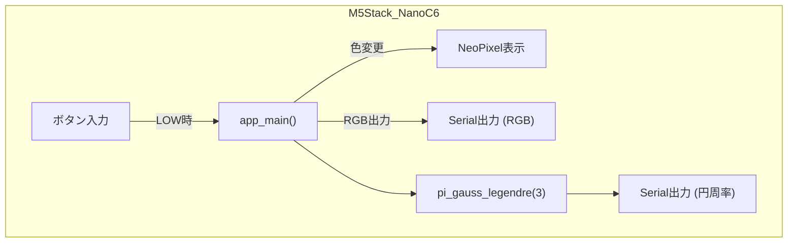

# M5Statck Nano C6 評価F/W開発
M5Statck Nano C6の評価F/W 個人開発リポジトリ

# 概要

* ボタン入力により NeoPixel の色を順に変更
* 計算された RGB 値をシリアルに出力
* ガウス＝ルジャンドル法で円周率を計算し、シリアル出力

## システム構成図

## 開発環境

#### 📍基板

- 📍[M5Stack Nano C6🔗](https://docs.m5stack.com/ja/core/M5NanoC6)

### 📍IDE

- 📍[Arduino IDE v2.36🔗](https://github.com/arduino/arduino-ide/releases/tag/2.3.6)
  - 📚️ライブラリ
    - [Arduino core for the esp32  v3.2.0🔗](https://github.com/espressif/arduino-esp32/releases/tag/3.2.0)
    - [Adafruit_NeoPixel v1.15.1🔗](https://github.com/adafruit/Adafruit_NeoPixel/releases/tag/1.15.1)

#### 📍ビルド構成

👇M5NanoC6のビルド構成

  

## ファイル構成

* `app_main.cpp`: アプリメイン
* `app_main.hpp`: アプリメインヘッダ

## 関数仕様

### app\_init()

* シリアル通信初期化
* NeoPixel 初期化と最初の色の表示
* 各 GPIO のモード設定と初期状態

### app\_main()

* ボタンの状態を監視し、押下で色を次に変更
* 現在の RGB 値をシリアル出力
* 円周率を計算しシリアル出力

### pi\_gauss\_legendre(uint32\_t iterations)

* ガウス＝ルジャンドル法による円周率の近似計算
* `iterations` 回数分反復して精度を向上